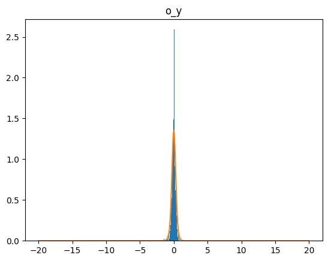
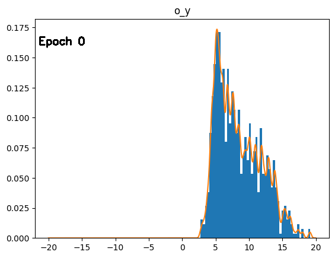
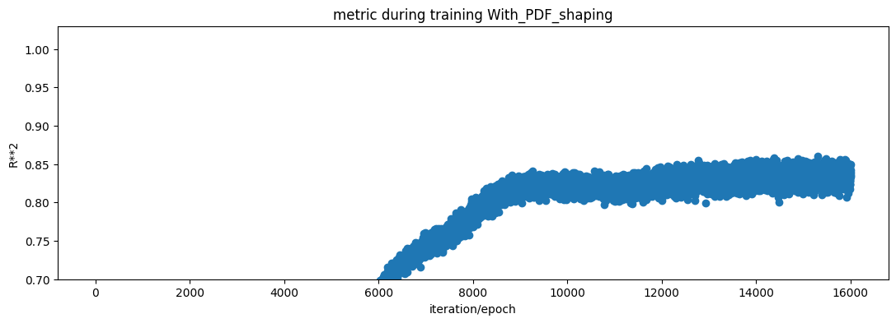

## Contents

This repo includes several proofs showing how PDF shaping works.

## Experiment 1 - using the Hong dataset

benchmarking 2x1

## Training with linear plus non linear (F1 plus F2)

Using the linear plus non-linear NN architecture, after training the model achieves:

* For training

Training loss: tensor(0.0654, grad_fn=<MseLossBackward0>)

Training R**2: 0.928283663941792

* For testing

Test loss - scaled: tensor(0.0764, grad_fn=<MseLossBackward0>)

Testing R**2 - scaled: 0.9152176200649317

Testing R**2 - Output: 0 o_y 0.915217627422392

Using PDF shaping does not significantly improve results. The error distribution after linear plus non linear training (and before PDF shaping) is as follows:

  
## F1 plus F2 model not trained. Training done on PDF shaping only

To see the effect of PDF shaping and prove that it works. I needed a model that predicted badly. So, I initialized the F1 plus F2 model but did not train it. Therefore, it can make bad predictions where the error has a non-gaussian and non zero mean just before starting PDF shaping. This is the error distribution just before PDF shaping training. 

The following gif shows an animation of the PDF shaping process from start to finish.
  

  

And this is the plot at the end of pdf shaping. As can be seen, it learned. 

  

## The R**2 results of just PDF shaping
  
As can be seen in this plot, the R**2 improved showing further evidence that PDF shaping learns.
  

  
And the final scores after 16,000 or so epochs of just PDF training were:
  
Training loss: tensor(0.1661, grad_fn=<MseLossBackward0>)
  
Training R**2:     0.8404849405287553
  

Test loss - descaled: tensor(0.7869, grad_fn=<MseLossBackward0>)
  
Testing R**2 - scaled: 0.8289912890034156
  

Testing R**2 - Output: 0 o_y 0.8289912984525767

## Details of the analysis

For more detailes of the analysis, go here:

https://github.com/rcalix1/ProbabilityDensityFunctionsFromNeuralNets/tree/main/experiments/2023/april2023

