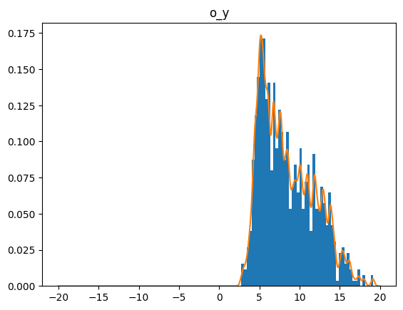

## Contents

This repo includes several proofs showing how PDF shaping works.

## Experiment 1 - using the Hong dataset

benchmarking 2x1

## Training with linear plus non linear (F1 plus F2)

Using the linear plus non-linear NN architecture, after training the model achieves:

* For training

Training loss: tensor(0.0654, grad_fn=<MseLossBackward0>)

Training R**2: 0.928283663941792

* For testing

Test loss - scaled: tensor(0.0764, grad_fn=<MseLossBackward0>)

Testing R**2 - scaled: 0.9152176200649317

Testing R**2 - Output: 0 o_y 0.915217627422392

Using PDF shaping does not significantly improve results. The error distribution after linear plus non linear training (and before PDF shaping) is as follows:

  
## F1 plus F2 model not trained. Training done on PDF shaping only

To see the effect of PDF shaping and prove that it works. I needed a model that predicted badly. So, I initialized the F1 plus F2 model but did not train it. Therefore, it can make bad prediction and have a non-gaussian and non zero mean just before starting PDF shaping. This is the error distribution just before PDF shaping training. 

And this is the plot at the end of pdf shaping. as can be seen, it learned. 

